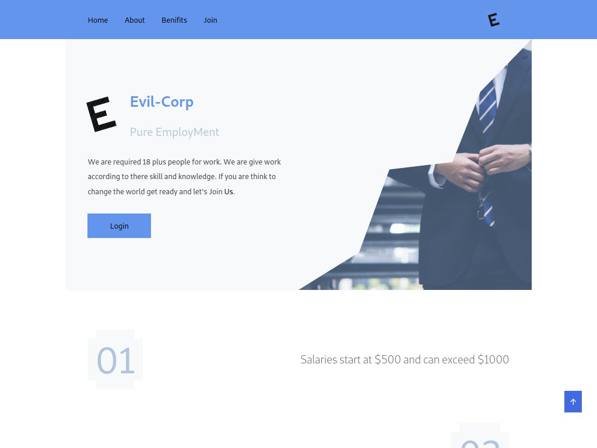

# website 6

- Name : "EvilCorp"

- Description : "Evil-Corp's Pure Employment Platform connects eligible unemployed individuals with opportunities."

- Version : version-2.0

- Update : 01-07-2023

- Status : Rest

- Responsive : False

- TecStack : { HTML | CSS | JavaScript }

- Thanks : { VSCodium | GitHub | Unplash | GIMP }

- Work : Self

- Design : { Mayank }

- Developer : { Mayank }

- CopyRight : { Evil-Corp | Mayank }

- URL : https://mayankdevil.github.io/EvilCorp/

- Clone : https://github.com/MayankDevil/EvilCorp.git

- Download : https://github.com/MayankDevil/EvilCorp/archive/refs/heads/main.zip

---

### Home Page

### Not Responsive

**only max than 900PX screen**

### Theme Mode

_"This website utilizes a light theme with a color scheme predominantly featuring shades of blue, ensuring a visually appealing and cohesive design."_

